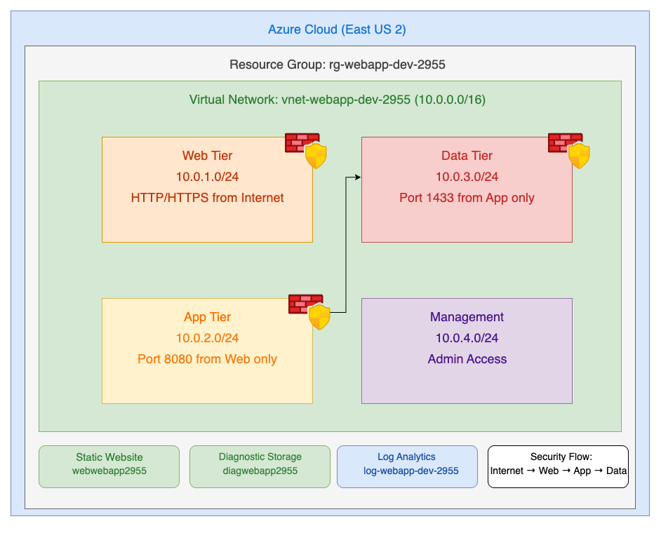

# Project 1: Enterprise Multi-Tier Web Application Infrastructure

## 📋 Overview

Production-ready Azure networking infrastructure demonstrating enterprise security design and Infrastructure as Code best practices. Built with Terraform for scalability and maintainability.

## 🏗️ What I Built

### Core Infrastructure

- **Virtual Network (10.0.0.0/16)** - Enterprise-grade network foundation
- **4 Subnets** - Proper tier separation (Web/App/Data/Management)
- **3 Network Security Groups** - Firewall rules for each tier
- **Static Website Storage** - Production web hosting capability
- **Log Analytics Workspace** - Centralized monitoring and logging

### Architecture Pattern

```text
                Internet
                    ↓
    Web Tier (10.0.1.0/24)     ← HTTP/HTTPS from internet
                    ↓ (Port 8080)
    App Tier (10.0.2.0/24)     ← Only from Web Tier
                    ↓ (Port 1433)
    Data Tier (10.0.3.0/24)    ← Only from App Tier
                    
    Management (10.0.4.0/24)   ← Admin access
```

## 🔒 Security Implementation

### Network Segmentation

- **Web Tier**: Allows HTTP (80) and HTTPS (443) from internet
- **App Tier**: Only accepts traffic from Web Tier on port 8080
- **Data Tier**: Only accepts database traffic from App Tier on port 1433
- **Zero Trust**: All other traffic explicitly denied

### Enterprise Security Features

- Layer 4 firewall rules (Network Security Groups)
- Subnet-level isolation
- Principle of least privilege access
- Defense in depth architecture

## 🛠️ Technology Stack

- **Cloud Platform**: Microsoft Azure
- **Infrastructure as Code**: Terraform
- **Networking**: Azure Virtual Network, NSGs
- **Storage**: Azure Storage (Static Website, Diagnostics)
- **Monitoring**: Log Analytics Workspace

## 🎯 Skills Demonstrated

- ✅ **Azure Networking**: VNets, subnets, security groups
- ✅ **Security Engineering**: Zero-trust network design
- ✅ **Infrastructure as Code**: Terraform configuration
- ✅ **Enterprise Architecture**: Multi-tier design patterns
- ✅ **Cost Optimization**: Free-tier resource utilization
- ✅ **Professional Practices**: Naming conventions, documentation

## 📊 Resource Details

| Resource Type     | Name Pattern                | Purpose                          |
| ----------------- | --------------------------- | -------------------------------- |
| Resource Group    | `rg-webapp-dev-[suffix]`    | Container for all resources      |
| Virtual Network   | `vnet-webapp-dev-[suffix]`  | Network foundation               |
| Subnets           | `snet-[tier]-dev`           | Tier separation                  |
| Security Groups   | `nsg-[tier]-dev-[suffix]`   | Firewall rules                   |
| Storage           | `web[suffix]`               | Static website hosting           |
| Log Analytics     | `log-webapp-dev-[suffix]`   | Monitoring                       |

## 💰 Cost Analysis

- **Monthly Estimated Cost**: ~$7 USD
- **Storage**: ~$2 (Standard LRS)
- **Log Analytics**: ~$5 (30-day retention)
- **Networking**: $0 (included in Azure)

## 🚀 Deployment

```bash
# Clone repository
git clone https://github.com/higgidv/azure-cloud-portfolio.git
cd azure-cloud-portfolio/project-01-multi-tier-webapp/terraform

# Deploy infrastructure
az login
terraform init
terraform apply -auto-approve
```

## 🔮 Next Phase

When quota limits allow, this foundation will support:

- App Service for dynamic web applications
- Azure SQL Database with private endpoints
- Application Gateway for enterprise load balancing
- Application Insights for advanced monitoring

---

**Enterprise-ready networking infrastructure built with professional cloud architecture principles.**
## 🔮 Project Evolution Roadmap

### Phase 2: Compute Layer (Pending Quota Increase)
- **App Service**: Deploy Linux web application hosting with VNet integration
- **Application Gateway**: Enterprise load balancer with SSL termination and WAF
- **Azure SQL Database**: Managed database with private endpoints for security
- **Application Insights**: Advanced monitoring, telemetry, and performance tracking

### Phase 3: Advanced Features
- **Container Orchestration**: Migrate to Azure Kubernetes Service (AKS)
- **CI/CD Pipeline**: Azure DevOps with automated testing and deployment
- **Auto-scaling**: Dynamic capacity management based on demand
- **SSL Certificates**: Managed certificates with automatic renewal

### Phase 4: Enterprise Scale
- **Multi-region Deployment**: Active-passive DR configuration
- **Azure Front Door**: Global load balancing and CDN
- **Key Vault Integration**: Centralized secrets management
- **Policy and Governance**: Azure Policy for compliance automation

### Phase 5: Observability & Security
- **Security Center**: Advanced threat protection
- **Azure Sentinel**: SIEM integration for security monitoring
- **Cost Management**: Detailed cost allocation and optimization
- **Backup and Recovery**: Automated backup policies

## 📈 Skills Progression

This roadmap demonstrates growth from:
- **Current**: Network and security foundation
- **Next**: Application platform engineering  
- **Future**: Enterprise DevOps and governance
- **Advanced**: Multi-cloud and hybrid architectures

---

*Each phase builds upon the secure networking foundation established in this project.*

## 📚 Lessons Learned

### Technical Insights
- **Azure Free Tier Quotas**: Compute resources have strict limits - plan architecture within quota constraints
- **Terraform State Management**: Proper state file handling is critical for team collaboration and infrastructure consistency
- **Security-First Design**: Implementing Network Security Groups before application deployment prevents security gaps
- **Resource Naming**: Consistent naming conventions with random suffixes enables automation and prevents conflicts

### Development Process
- **Infrastructure as Code Benefits**: Terraform enables repeatable, version-controlled deployments across environments
- **Modular Architecture**: Separating networking and compute concerns improves maintainability and reusability
- **Documentation During Build**: Creating documentation while building prevents knowledge loss and improves quality
- **Version Control Workflow**: Professional Git practices with meaningful commits demonstrate enterprise readiness

### Cloud Architecture Patterns
- **Multi-tier Design**: Subnet segmentation provides security boundaries and scaling flexibility
- **Zero-Trust Networking**: Explicit firewall rules between tiers reduce attack surface
- **Monitoring Foundation**: Early Log Analytics implementation enables observability from day one
- **Cost Optimization**: Strategic use of free tier resources while maintaining enterprise design patterns

### Project Management
- **Iterative Deployment**: Building networking foundation first enables adding compute layers incrementally
- **Quota Planning**: Understanding cloud provider limits informs architecture decisions
- **Professional Presentation**: Quality documentation significantly impacts portfolio effectiveness


## 🏗️ Architecture Overview



*Multi-tier Azure infrastructure with security-first design and zero-trust network segmentation*

### Key Architectural Components
- **Internet Gateway**: Public entry point with traffic filtering
- **Web Tier**: Public-facing subnet for front-end applications
- **Application Tier**: Protected business logic layer with restricted access
- **Data Tier**: Secure database subnet with database-only traffic
- **Management Tier**: Administrative access with separate security controls

### Security Design Principles
- **Zero-Trust Networking**: Each tier explicitly controls allowed traffic
- **Defense in Depth**: Multiple security layers (NSGs, subnets, monitoring)
- **Principle of Least Privilege**: Minimal required access between tiers
- **Network Segmentation**: Isolated subnets prevent lateral movement

